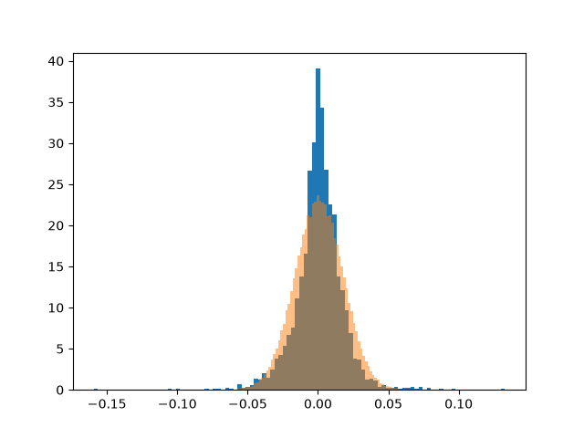

# Analizador de activos
Es una herramienta de Python que analiza el riesgo, la correlación y el retorno de una acción a partir de datos históricos.

## Qué hace
- Baja 10 años de precios
- Calcula retornos logarítmicos y retorno total
- Volatilidad anualizada, mensual y diaria
- Max Drawdown
- La correlación con el S&P 500 (SPY)
- Nos da un histograma de retornos reales vs distribución normal
- Genera un informe de texto y un gráfico

## Cómo usarlo
- Requisitos: Python + las librerías que se usan: numpy, pandas, matplotlib, yfinance
- Ejecutar: `uv run capstone.py`
- Genera: `informe.txt` y `histogram.png`
- Para analizar otra acción o período: cambiar el ticker y el `period` en las llamadas a `yf.download`

## Ejemplo de output (MSFT, 10 años)
Análisis de MSFT - período: 10 años
Volatilidad anual 27.1921%
Retorno total: 725.4874%
Maximo DrawDown: -37.1485%
La correlacion con el SPY: 0.7698

## Nota
Los retornos reales tienen más eventos extremos de lo que predice la distribución normal. La campana es delgada en las colas, cuando en la realidad es gorda: un evento diario de 5 desvíos debería pasar 1 vez cada +10.000 años, pero en la realidad tiende a ocurrir cada pocos años.

## Tecnologías
Python · numpy · pandas · matplotlib · yfinance